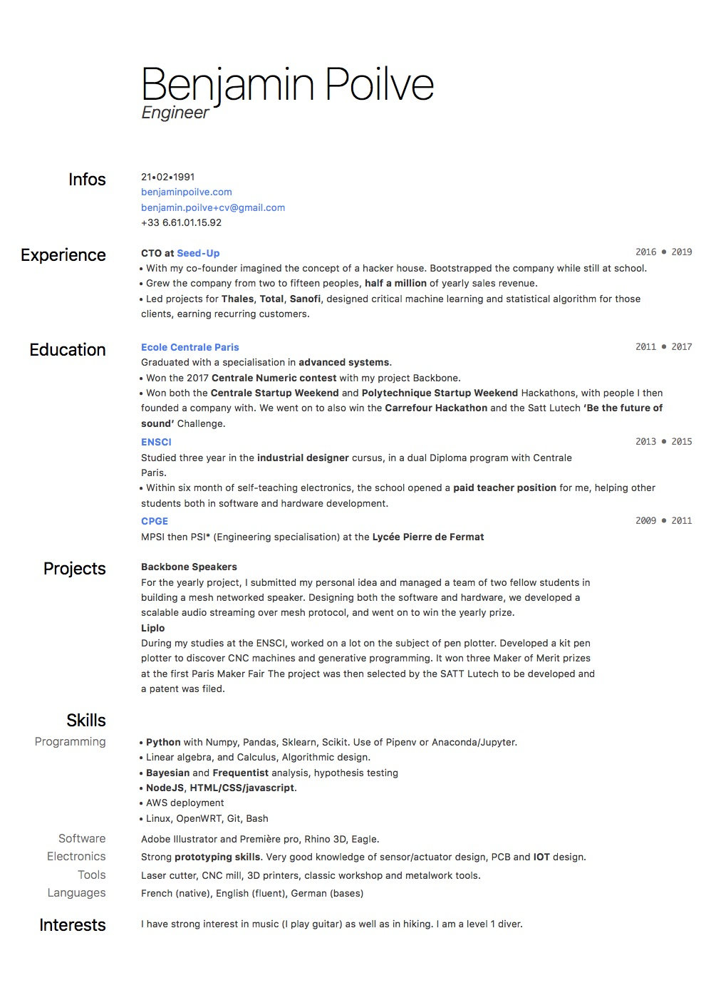

# Style for Cover Letter and Resume

Since I am a satisfied user of [Macdown](https://macdown.uranusjr.com/) I decided the easier way to have a consistent styling at low effort was to make custom css files for both

Here is the result! 

for the resume!

for the cover letter!

(looks much better on PDF)